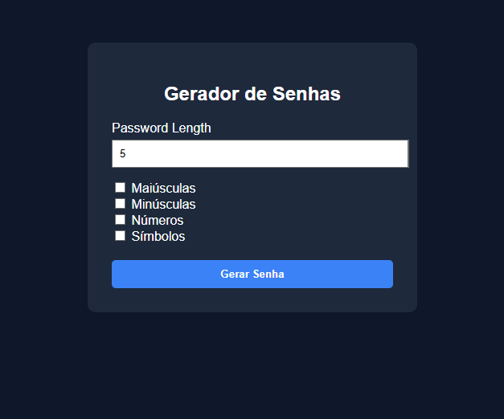

## 🔐 Gerador de Senhas

Interface simples para geração de senhas seguras com avaliação de força.

Um gerador de senhas desenvolvido em **Python com FastAPI**, criado inicialmente como um projeto simples e que será evoluído para uma **plataforma completa com práticas modernas de DevOps, Cloud e Observabilidade**.

O objetivo deste projeto é demonstrar habilidades em **backend, infraestrutura, containerização, Kubernetes e monitoramento**, transformando um serviço simples em uma aplicação **cloud-native**.

### 📸 Preview



---

# 🚀 Funcionalidades

- Geração de senhas seguras 
- Definição do tamanho da senha 
- Seleção de tipos de caracteres: 
  - Letras maiúsculas
  - Letras minúsculas
  - Números
  - Símbolos
- Avaliação da força da senha 
- Barra visual indicando a força da senha 
- Interface web simples 
- log estruturado em Json :
  - informação sobre senha gerada
  - captura de erros de de validação

---

# 🛠️ Tecnologias Utilizadas

Tecnologias atuais:

- Python
- FastAPI
- HTML
- CSS

Tecnologias planejadas para evolução do projeto:

- Docker
- PostgreSQL
- Kubernetes
- Prometheus
- Grafana
- OpenTelemetry
- Terraform
- AWS (EKS ou ECS)

---

# 📂 Estrutura do Projeto

```
password-generator
│
├── src
│ ├── generator.py
│ ├── strength.py
│ ├── cli.py
│ └── strength.py
│
├── web
│ ├── server.py
│ └── templates
│
├── main.py
├── requirements.txt
└── README.md
```


---

# ▶️ Como Executar o Projeto Localmente

### Instalar dependências

```bash
pip install -r requirements.txt
```
### Iniciar servidor
```bash
python -m uvicorn web.server:app --reload
```
### Acessar no navegador

```bash
http://127.0.0.1:8000
```